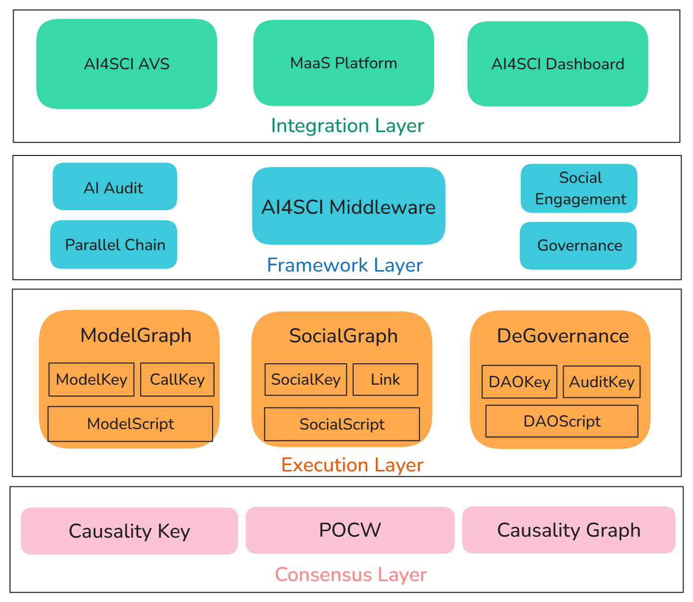

# AI for Science OS
This repository contains all the documents for the Hetu's AI for Science OS (AI4SOS).

AI for Science OS is a modular framework designed to accelerate scientific breakthroughs by integrating AI, blockchain, and open-source collaboration. It empowers researchers, institutions, and citizen scientists to co-create, validate, and scale AI-driven solutions.

## Vision
Democratize scientific innovation by transforming isolated research silos into a globally accessible, value-aligned network.

- ✓ **Openness and Transparency:** The entire process is traceable, and the results are verifiable.
- ✓ **Cross-disciplinary Collaboration:** Break down the boundaries of organizations, technologies, and regions.
- ✓ **Fair Value Distribution:** Contribution incentives based on causal attribution.
- ✓ **Technical Agility:** Modular design to adapt to rapidly changing AI innovation.
- ✓ **DeSci Infrastructure:** Provide comprehensive support for decentralized science.

**Why AI4SOS?**
- **For Community:** Foster efficient collaboration within a diverse community through transparent processes and fair value distribution based on contributions.
- **For Researchers:** Break free from paywalled tools and siloed data. Own your IP while contributing to a collective knowledge base.
- **For Institutions:** Reduce R&D costs via shared AI infrastructure, with audit trails for grant compliance.
- **For Humanity:** Turn peer-reviewed papers into executable code—making science transparent, reproducible, and scalable.

## Module Overview
The current AI4SOS framework includes the following modules:

1.  **Specialized AI Engine**
    1.  Specialized AI Model Training
    2.  Data Crowdsourcing and Preprocessing
    3.  Specialized Model Self-Deployment and Inference Services
    4.  Model Evaluation and Feedback System
    5.  Multi-Agent framework powered by Specialized models

2.  **DAO Governance and Audit Framework**
    1.  Proposal review and approval process based on contribution weights.
    2.  Process Review: Fully automated audit and verification of the governance and workflow process.
    3.  Funding Allocation Tracking: The use of research funds is transparent and traceable.
    4.  Novel Assetization: CausalityKey Protocol

3.  **Traceable Incentives Based on Causality**
    1.  Dependency Graph generation based on model evolution and composition to show contribution dependencies.
    2.  Call Graph synthesis based on model functions and responses to demonstrate observability of AI collaboration relationships.
    3.  Automated reward distribution based on causal analysis of Dependency Graph and Call Graph using CausalityKey.

4.  **SocialGraph**
    1.  Early Signal Discovery: Utilize graph algorithms to quickly identify emerging narratives, potential projects, or KOLs with rising influence.
    2.  Deep Relationship & Influence Mapping: Reveal complex relationship networks between entities (users, projects, tokens, institutions), visualizing influence flow paths and community structures.
    3.  Information Filtering & Contextual Intelligence: Transform raw data into structured, contextual insights through data cleansing, entity linking, sentiment analysis, and correlation analysis, providing users with clearer and more relevant market intelligence.

5.  **Alignment and Security of AI and Data**
    1.  AI Fairness and Bias Mitigation, addressing harmful outputs or hallucinations.
    2.  Secure Data Storage & Transmission
   
## Core Components
-   **DeAI Infrastructure**
  
    Infrastructure components covering functions such as model training, data crowdsourcing, model deployment, model evaluation, model feedback, and multi-agent collaboration.

-   **[CausalityGraph](https://github.com/hetu-project/causalitygraph)**
  
    A decentralized data collaboration network based on verifiable logical clocks and Proof of Contribution Work (POCW). It provides foundational data sources for model evolution dependency graphs, governance and audit frameworks, SocialGraph, and CausalityKey reward distribution by constructing databases, knowledge graphs, etc.

-   **[ModelGraph](./modelgraph)**
  
    ModelGraph is a protocol for establishing verifiable contribution graphs during AI model evolution and composition output processes. Combined with the off-chain CausalityGraph, ModelGraph can provide model evolution dependency graphs, agent and resource call relationship graphs, and leverage blockchain technology for transparent, verifiable, and real-time incentives.
